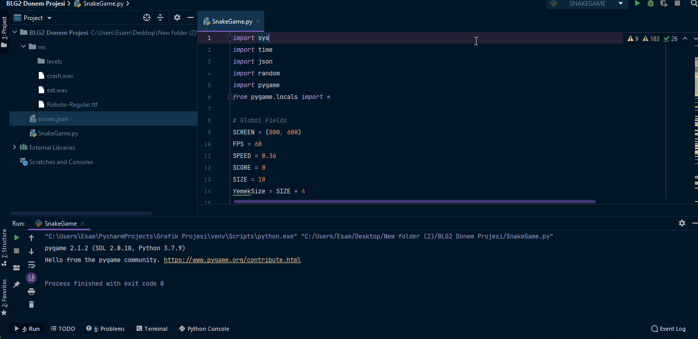

# Snake-Game

 A simple snake game made using pygame.

# Attribution
#### Big thanks to @youtube 'Techie Coder' for his [snake game tutorial](https://www.youtube.com/watch?v=2C_YaOQ2yGg&list=PLpp8-k7G_6Y3Wj1suZQ-9lATFzFuGw93x&index=6). His code was really helpful in understanding and making this project
#### Big thanks to @youtube 'Clean Code' for  [providing the Button class](https://www.youtube.com/watch?v=8SzTzvrWaAA) which was used in creating the menus
#### Big thanks to @stackOverflow 'skrx' for providing the method for [creating a textbox with pygame](https://stackoverflow.com/questions/46390231/how-can-i-create-a-text-input-box-with-pygame/46390412#46390412)
